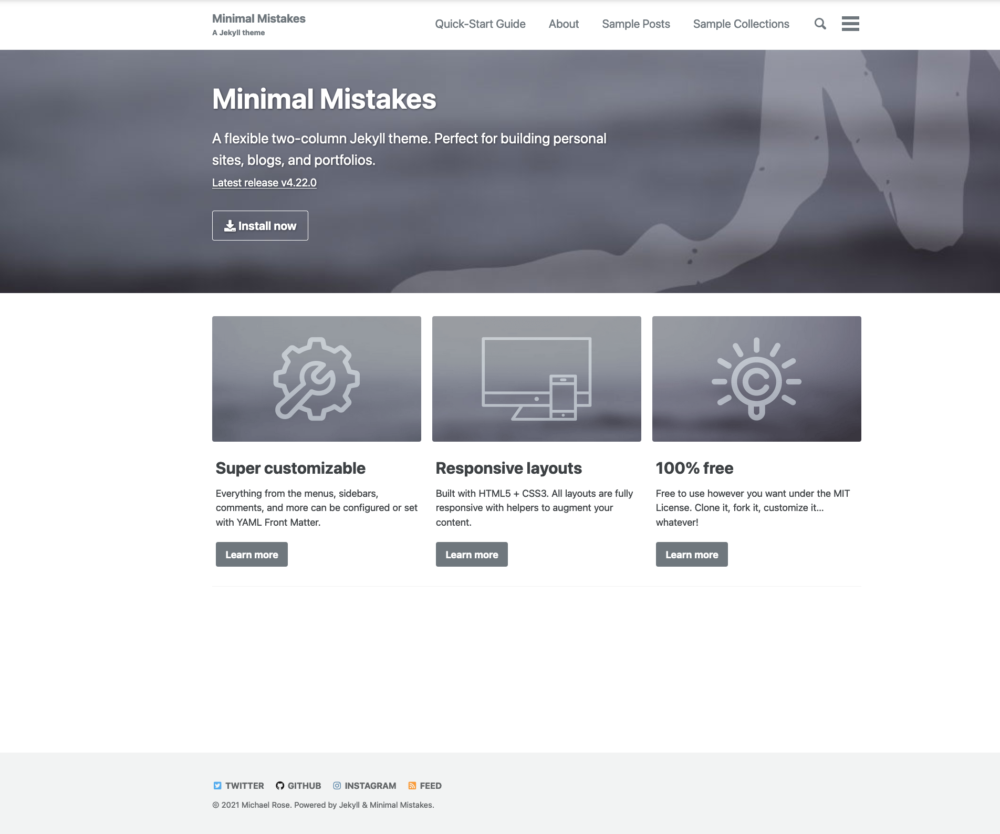
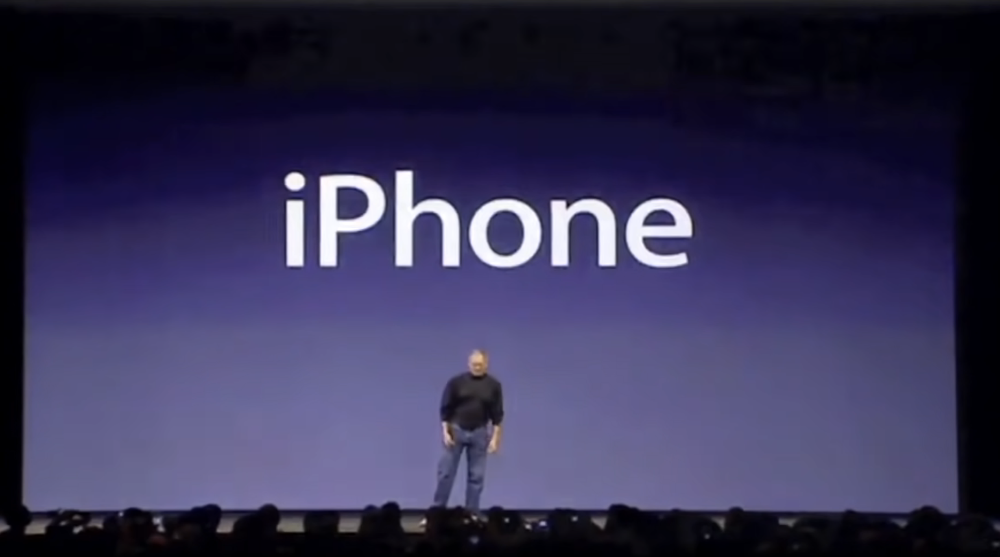

Minimalists haven't got the memo yet: every website looks exactly the same. Once you casually search for themes on [jamstackthemes.dev](https://jamstackthemes.dev/theme/), you start to realise two things. _Primo_, that virtually all the descriptions contain the word "minimalist". _Secondo_, that every theme has that Medium-like flavour, the containerised structures, the white backgrounds (or black, if they provide with a dark theme). The same, sans-serif typography, hero titles and clean (too clean?) ambience.
It's as if people around the world agreed to design Just OneTM Website Layout, and we are simply looking at different flavours of their masterpiece.

It's time to say it: Minimalism's design philosophy has reached a dead end. There's nothing novel about it anymore.

Minimalism has been the last twenty years' defining aesthetic. It represents what my generation craves the most: efficiency and simplicity. Minimalism was a reaction against the Diogenes society that was instructed by marketing to amass and posses. The world is impossibly complex, difficult to navigate, and full of clutter from a distant past, and we need to "start from scratch" and
remove everything, only keeping what we really need. The climactic moment for minimalism was [Steve Jobs's introducing the iPhone](https://www.youtube.com/watch?v=x7qPAY9JqE4&t=1m24s)1
1"<em>An iPod, a phone, and an Internet communicator. Are you getting it? These are not three separate devices. This is one device. And we are calling it iPhone.</em>"
.

We have gone downhill since then. Everything is _the same_. Websites have become so similar that someone trained a neural network
to churn websites for [startups that do not exist](https://thisstartupdoesnotexist.com/).

Why? Because minimalism is another word for playing it safe. It's shooting for mediocrity instead of attempting to become competent. Everyone buys the same products, wear the same clothes, thinks the same way. There's no need for alternatives. The logical consequence of minimalism is precisely the _digital hub_: Jobs' cohesive plan to take all of your devices and make them one harmonious product. All your Apple products of course.

It's all over now. Minimalism doesn't work because having Just OneTM of anything is not enough. It stagnates, then decays, and finally perishes, leaving us just with the ashes.

> Most people are cucumbers; boring, predictable, almost tasteless, okay for a salad but keep them away from my spicy tacos. Pickles, however, are tangy, crunchy, delicious, unpredictable, and perhaps most importantly, pickled.
>
> — **Dan Piraro**

Minimalism is for cucumbers. Let's be crunchy pickles.
