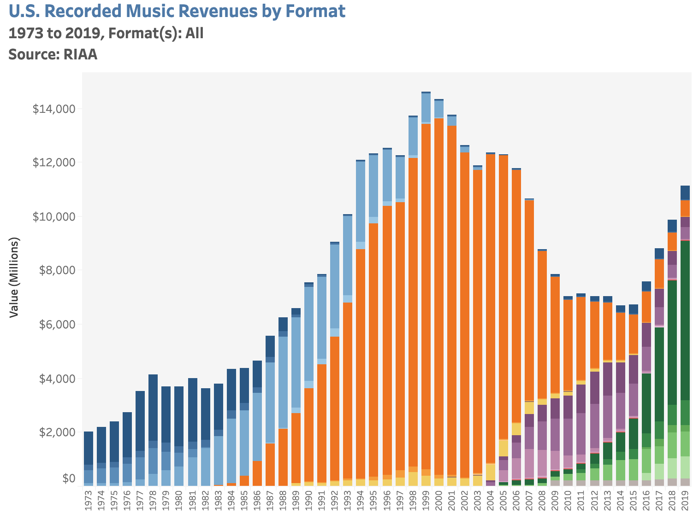

En el año 1999, las cifras de ingresos de la industria musical batieron un récord. En EEUU, las ventas alcanzaron un total de 14,600 millones de dólares. Es el momento de [Cher](https://www.youtube.com/watch?v=nZXRV4MezEw), de [Ricky Martin](https://www.youtube.com/watch?v=p47fEXGabaY), y de los [Back Street Boys](https://www.youtube.com/watch?v=4fndeDfaWCg).

El diablo, de todos modos, está en el detalle: de esos 14,600 millones, casi 13,000 provienen de la venta de [CD-ROM](https://en.wikipedia.org/wiki/CD-ROM)s. Es decir, que la industria musical basaba su enorme éxito en la distribución de discos de plástico magnetizados, empaquetados en cajitas con una portada artística, y que se diferenciaban unos de otros por la información digital que contenían.

Esto parece una distinción estúpida, pero viene a explicar muy bien lo que ocurrirá a partir de entonces:

Del año 2000 en adelante, los ingresos de la industria musical van a caer en picado, y eso a pesar de que la distribución de música va a ser mucho más fácil que nunca. El problema es que esa distribución no va a consistir en vender discos de plástico magnetizados. La gente, simplemente, se descarga la música directamente.

El problema con la música es que no tiene ningún valor: una vez grabada, se puede copiar sin parar, con lo que la oferta es infinita. La única manera de fijar un precio que no sea “cero” es imponer escasez de algún modo. Esa es la función que los CDs cumplían: una oferta finita de algo tangible, que se diferencia de los demás por ser la manera más cómoda de escuchar música. A partir del año 2000, va a aparecer una manera aún más cómoda (y más barata) de escuchar música: Napster, y las redes _peer to peer_ o P2P.
