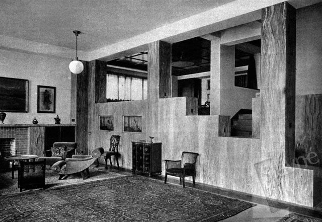
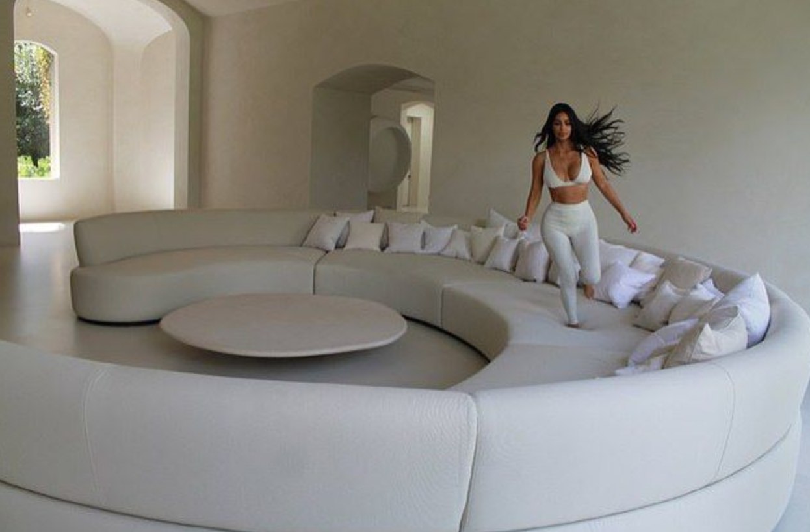
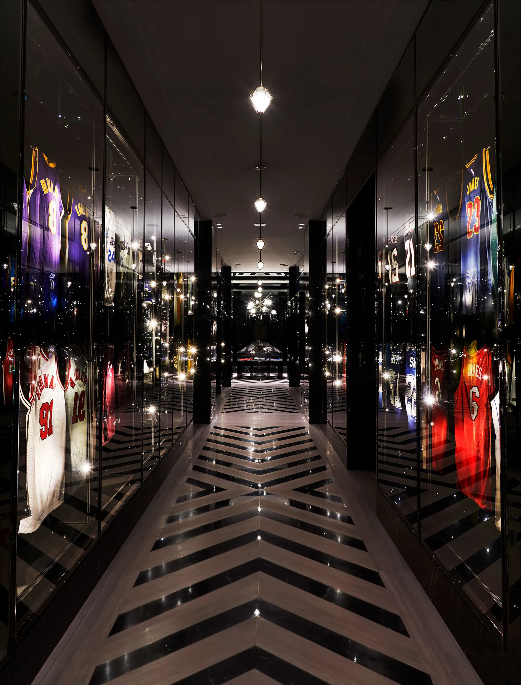
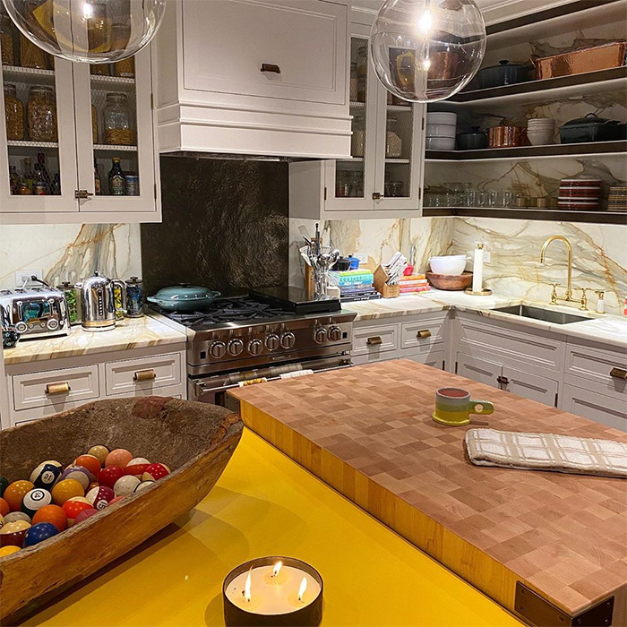

In 1910, the Austrian architect Adolf Loos delivered a lecture titled "Ornament and Crime", in which he argued against any
form of decoration. A truly civilised person, he said, would have "*outgrown ornament*". Loss advocated a spare and austere
form of design, where function was predominant rather than concealed, and where monochromatism would highlight the natural
properties of the materials.

"Ornament and Crime" was a response to a time (early twentieth century) and a place (Vienna) in which Art Noveau
was at its peak. But it's remarkable how much of it is present in Kim Kardashian's mansion. A white, diaphanous
place, it's an ode to unused space. Like in the middle of the ocean, everything feels miles apart, and nothing steers you
away from realising that it isn't your typical urban loft, which is precisely the point. "The proportions are the decoration",
[said Kayne West in an interview with Architectural Digest](https://www.architecturaldigest.com/story/kim-kardashian-kanye-west-home).
The place is the architectural epitome of how much it costs to maintain an immaculate emptiness.

Some people, especially today's wealthiest individuals, seem to be in the lookout for space to clear. Mark Zuckerberg
was accused of "colonising" the Hawaiian island of Kauai because he allegedly forced his neighbours to sell the land near
his property. Jeff Bezos recently bought the mansion across the street from the two mansions he had already in
Washington, D.C., and combined them into the single largest man cave ever.

Average young adults, meanwhile, are left with way less ambitious spaces, but the mindset is by all means the same. What is
the point, then, of tyiding up with Marie Kondo if not to transform your Diogenes-like compulsive hoarding of stuff into spaces
of unsoiled nothingness? And yet, the end result is just a bland imitation: our attempt to Keeping Up With The Minimalists
ends up being a Swedish aesthetic of sameness. We are nudged into consuming what's quick and easy, delivered to our front
doors, rather than taking the time to cultivate our own idiosyncratic taste. 

Why reflect, when an enthusiastic blogger's opinion is one search away? Who has time for **making a couple mistakes**?
What do *I* care? Rather than facing the stakes, we end up ordering the product from whichever ad our favourite social network
puts in front of us more often. Safe from the difficulty of doubt, we part ways with the responsibility of choice.

Adolf Loos considered futile decoration a form of savagery, like facial tattoos, and posed the reductive
modernism of Europeans—something another Austrian Adolf may sympathise with— as the final solution to all aesthetic problems.
Be that as it may, it's possible that what Loos had in mind actually resemble the Kardashians, the Zuckerbergs and the Bezos
more than your ordinary Färgglad chair or any pre-fabricated, drop-shipped, Amazon-delivered paraphernalia. Loos wanted
customised, thoughtful environments that provided anything its dwellers needed. Instead, your everyday aesthetic is inspired
by Le Corbusier's idea of a house: "*a machine for living in*". Inhumane.

Not all is lost, however. **Coming like a wrecking ball**, the new generations' sensibility is nothing but *baroque*. At
the highest end, Drake's hall displaying his collection of basketball jerseys— like African taxidermy— give the impression
that today's rappers are contemporary adaptations of the Great Gatsby; and Gigi Hadid's maximalist kitchen counter filled
with billiard balls beggs the question: **what?**

**The fact** is that this unapologetical aesthetic is the fulfillment not of the vision of a cantankerous architect, but
of a personal identity. Rather than consulting with a committee on best practices, post-minimalists' approach is "**this
is our house, this is our rules**". There is a sheer intention, nothing is frugal, and the thinking happens inside the dweller's
head, **tired of being told what to do**. The result has nothing to do with what an irresponsible less-is-more conformist
would be able to come up with. Something humane. When your domestic space is all you have, maximalism is more appealing
than über-efficient, played out minimalism. A true assertion of individualism is, perhaps, this new era's signal for wealth.

Surprisingly, individual assertion is nowhere to be seen in Web design. What's even worse, those who pioneered a new approach
to site layouts, such as Jason Santa Maria, Dustin Curtis, or Greg Wood, have now reverted back to simple and minimalistic
websites, designed under the driving force of a played out philosophy.

Why aren't there more e-commerce sites that are visually appealing? Why in a world where Amazon has defined the boring
thumbnail grid as the lowest common denominator, most indie online stores choose to zig rather than zag?

Perhaps the Web being driven by a tendency to follow best practices and accommodate to Google's warped sense of 
what's *evil* reins in unconventional layouts. Perhaps the sense of nonstop supervision and criticism hypertrophies our
selfconsciousness and instinctive conformity. Perhaps it's just that simple is easier than complex, and less error-prone.

Advances in technology have made possible to unstuck ourselves from Adolf Loos's view, but we haven't advanced emotionally
online. We're stuck in a rut! It's time to step up, to look ahead instead of around, and build sites where it's clear to
see the people who made them, rather than the frameworks they used. It's time to move beyond the gravitational pull of
the social network's design of rigid likeness, algorithmical optimization of pictures and captions, and orthodoxy.

Let us build humane sites, for a humane web.