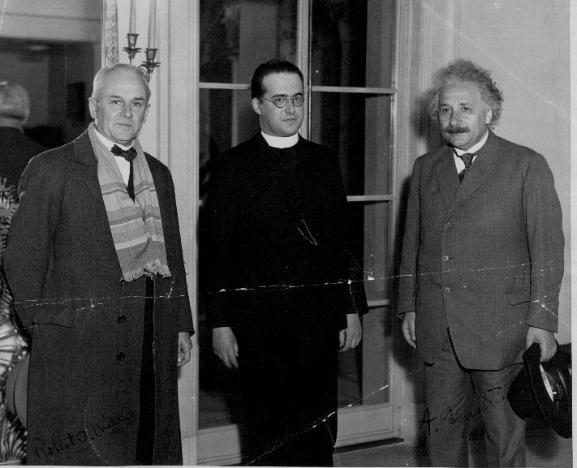

In 1927, George Lemâitre, a Belgian Catholic priest, noted that one of the solutions to Einstein's equations in the general
theory of relativity allowed for an expanding cosmos. That led him to postulate that the Universe must have begun at some point,
and called it the "primeval atom".

Einstein, when first confronted with this solution, informed Lemaître that he found the idea "abominable", and force his
theory back into a static configuration with a completely made up change. Even as tensions with new observations increased,
the idea of an unchanging universe remained popular for a time, while Lemaître's idea of a primordial point received the
picturesque name of "Big Bang theory".

What is an original thought? Many people would say one that no one has come up with before. But I don't think that's
exactly true. I believe that original thoughts are like the Big Bang theory: surprising consequences of simply
rearranging what came before.

That's why originality seems paradoxical: a common critique of an original idea is "I thought of that before".

Originality means finding new ways of describing the world. And if the world were static, human beings wouldn't need originality.
All the good ideas would have already been recorded already, and human beings would have had to find something else to do.

But we don't live in a static world; nor do we live in one that we fully understand. In a sense, we are no different from
a paleolithical tribe that sits around the campfire at night: feeling awe when looking up at the stars, and terror when
confronted with what's beyond the light. An original thought is like a torch, born from that shared fire, with the purpose
of illuminating the way into the darkness.

Original is not simply being surprising. It has to have structure, whereas a surprise can simply be something that makes you flinch.
On the other hand, just rearranging information lacks the power of awe that originality entails.

So it seems to me that originality is not in saying that God created the world, but in remarking that Einstein's relativity
predicts something in accordance to that. And that is precisely why it is so useful: our knowledge is not a tight-knit
network, but a somewhat structured bowl of spaghetti, and any help in the process of disentanglement is very much welcome.

We surely value it, rationally and biologically. An independent mind can be magnetic, be it a comedian or a politician, for as
long as it thinks the right thoughts.

In an interview with Jordan Peterson, comic-book writer [Gregg Hurwitz](https://en.wikipedia.org/wiki/Gregg_Hurwitz) said
that once characters like Batman or any of the Avengers take off and establish a life of their own, they have a backstory
collectively held by the readers. You may come up with an alternative universe where you can muck around as much as you want,
but otherwise you'd better not venture too far from the backstory or you're going to get letters from readers telling you that you got
it wrong. And so in order to be original and successful there must be a collaboration between the writer and the readers,
between what's surprising and what's already part of the structure. No wonder why most comic books gravitate towards mythological themes.

---

If originality is so valuable, why is it so rare? Perhaps because thinking deliberately is something that doesn't come
natural to human beings. Our animal brain[^1] favours prompt action and false positives (not doing it millions of years ago meant you would soon be a predator's dinner),
and thinking deeply is only a very late development, something we need to be doing consciously and on purpose, drawing from a pool of
resources that the rest of our mental system resists to share. Original is also something that makes the one that has it
salient, and that is something that we avoid instinctively as part of our efforts to conform to the group.

A good heuristic for achieving originality is bringing a common idea to its ultimate consequences. Most dystopian novels
exemplify that framework: <book>Brave New World</book> is Aldous Huxley's novel on the catastrophe of hedonism,
Orwell's <book>1984</book> is a study of how a world too safe looks like, and Asimov's <book>
Foundation</book> series is just a portray of the decline and fall of the Roman Empire in a futuristic
fashion[^2]. In all these cases, the author is trying to answer the question "How would the world would be if this condition of human experience tilted to its maximum value?". In many cases, the answer is in the form of "Not Good", but it doesn't always have to be the case.
Just imagine [a world without lawyers](https://www.youtube.com/watch?v=uG3uea-Hvy4).

Another good heuristic is taking things out of their common context, as it is the case with idioms like "papering over
the cracks", or "a new broom sweeps clean". Most memes on Reddit fit this category nicely[^3].
It also pervades pretty much all political and business discourse, and conforms the building blocks of virtually all funny jokes.

> Politicians and diapers must be changed often, and for the same reason.
>
> — _Mark Twain_

Originality seems to be more a consequence of curiosity than mechanical thought though. You look into what the world is,
and how it is currently described, and compare the differences. I would say that's 90% of what it takes: the rest is probably
finding the right words for it.

To some degree, people are curious, and articulate, but usually not both, and as luck may have it, curiosity could lead you
to unfruitful paths. Despite that, I do believe that there hasn't been a period of time when being curious didn't end up in
novel discoveries, so my piece of advice is this: Be curious, and originality will take care of itself.

[^1]: The one that Kahneman and Tversky called **System I**.
[^2]: That, at least, according to the afterword for "Legal Rites", one of the short stories collectively known as <a href="https://en.wikipedia.org/wiki/The_Early_Asimov">The Early Asimov</a>.
[^3]: For instance, on Joe Biden's inauguration day, thousands of people photoshopped senator Bernie Sanders into a myriad of different contexts.
